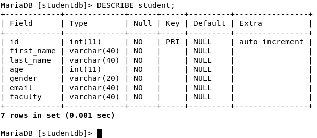

# Mock-University-Website
This is a simple web application which mimics the university website. It has different pages which contain introductions to the different faculties in Politehnica University of Bucharest. Users are also able to register themselves on the website, and their information is stored on a database. The records stored on the database can be edited and deleted as well.

The project was developed on Debian, and it uses flask, HTML, and a locally hosted MariaDB database. This project was done as an assignment given in the Operating Systems 1 Course.

## Prerequisites

Before setting up the project, ensure you have the following installed on your Linux system:

- Python 3.x
- Pip (Python package manager)
- MariaDB server
- Git (to clone the repository)

## Setup Instructions

### 1. Clone the Repository

First, clone the repository from GitHub to your local machine:

```bash
git clone https://github.com/Azzamjoy44/Mock-University-Website.git
cd Mock-University-Website
```

### 2. Install Python Dependencies

Install the necessary Python packages using pip. This project uses Flask 
and mysql-connector-python for interacting with the MariaDB database

```bash
# Update pip to the latest version
pip install --upgrade pip

# Install dependencies
pip install flask mysql-connector-python
```

### 3. Set Up MariaDB Database

Install MariaDB server if it's not already installed and start it:

```bash
sudo apt update
sudo apt install mariadb-server

sudo systemctl start mariadb
```

### 4. Configure the Database

Log in to MariaDB as the root user and create the studentdb database:

```bash
sudo mysql -u root -p
```

Inside the MariaDB shell, run the SQL commands from the [script](db_creation_script.sql), then run the following command and make sure you get the same result as in the picture. 

.


### 5. Running the Application

To run the Flask application, execute the following command in the project directory:

```bash
python3 index.py
```
